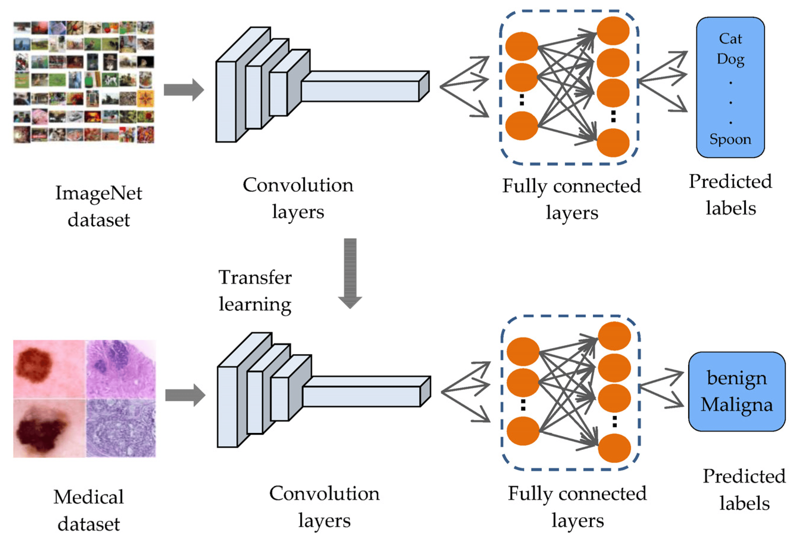

# Transfer Learning

- **Transfer learning allows us to take the patterns (also called weights) another model has learned from another problem and use them for our own problem**.

- For example, we can take the patterns a computer vision model has learned from datasets such as ImageNet (millions of images of different objects) and use them to power our FoodVision Mini model.

- Or we could take the patterns from a language model (a model that's been through large amounts of text to learn a representation of language) and use them as the basis of a model to classify different text samples.

- `The premise remains: find a well-performing existing model and apply it to your own problem.`

---

### Types of `Transfer learning` 🚎

It is of two types:

1. **Fine-tuning** (`we train all the parameters again`)
2. **Fixed feature extractor** (`we freeze most of the layers and only train the few end layers`)

- In both cases, we modify the end layers as per our requirement. (If original model has 1000 output for the last layer and we only need 5, we modify accordingly).